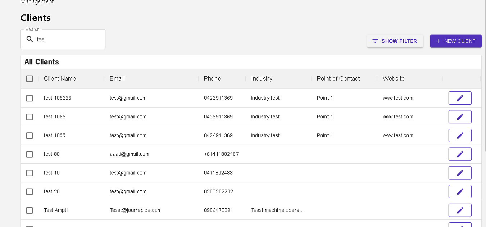

# React Table API
* Webpage made using REACT.JS to request data from an API and fetch into a table containing Edit / New CLient options, Search, Pagination and number of Rows per page.

## Screenshot

